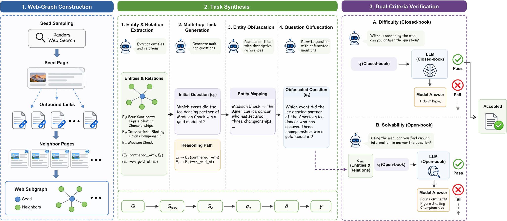

<div align="center">

</div>

---

<div align="center">
🤗 <a href="https://huggingface.co/AllSpark-Research"><b>Hugging Face</b></a>&nbsp;&nbsp;|&nbsp;&nbsp;
💻 <a href="https://github.com/AllSpark-Research/Iris"><b>GitHub</b></a>&nbsp;&nbsp;|&nbsp;&nbsp;
🔬 <a href="https://github.com/AllSpark-Research"><b>AllSpark Research</b></a>
</div>

# Iris

**Climbing to the Search Frontier.**

Iris is a pair of open-weight search agents built to find things on the live web: the kind of
question whose answer is not in any model's parameters, is not on any single page, and only
appears once several indirect clues have been chased down and reconciled.

We are releasing two models, post-trained from the Qwen3.5/3.6 series:
**Iris-mini** (35B-A3B) and **Iris-pro** (397B-A17B). Both run as a single ReAct agent with a
search tool and a page reader. No sub-agents, no test-time verification, no answer voting.

Three things shape the recipe. Training questions are **reverse-constructed** from the hyperlink
structure of a web corpus and then stripped of every directly searchable anchor, so a question
cannot be resolved by pasting a name into a search box. Training itself **alternates** supervised
fine-tuning and reinforcement learning, returning the hardest solved and most efficient rollouts
of each RL round to the next supervised pass. And every benchmark is reported **twice**, with and
without inference-time context management, because that wrapper is worth more on these benchmarks
than most of the methodological differences between systems.

## Open Source

| Model | Base | Total / Active | Context | Download |
| --- | --- | --- | --- | --- |
| **Iris-mini** | Qwen3.6-35B-A3B | 35B / 3B | 256K | _coming soon_ |
| **Iris-pro** | Qwen3.5-397B-A17B | 397B / 17B | 256K | _coming soon_ |

Weights will be published under [AllSpark-Research](https://huggingface.co/AllSpark-Research) on Hugging Face.

## Highlights

- **Questions that cannot be shortcut.** Every non-answer entity in a synthesized question is
  rewritten into a descriptive reference, so the intended multi-hop path is the only path. A
  question is kept only if a reference model *fails* it closed-book but *solves* it once the
  supporting evidence is supplied: hard and solvable at the same time.
- **Two-level trajectory filtering.** Whole trajectories are gated on correctness, degeneracy,
  and search depth; individual turns are then labeled by a judge whose rubric is induced from the
  data rather than written by hand. Masked turns stay in context but carry no loss.
- **SFT–RL climbing.** Each round of RL explores; its hardest solved and most efficient rollouts
  are consolidated by a supervised pass; RL resumes from there. The difficulty band is defined
  against the current policy, so the training slice tracks the frontier automatically.
- **Reported in both regimes.** With and without context management, under one tool set, one
  context limit, and one judge. The gap between the two is large, uneven across benchmarks, and
  smaller for the larger model, which is exactly why we think it should be reported separately.

## Performance

<table>
<tr>
<td width="50%"></td>
<td width="50%"></td>
</tr>
<tr>
<td width="50%"></td>
<td width="50%"></td>
</tr>
</table>

All Iris numbers below use the `discard-all` context-management setting, which we treat as the
default. Baseline numbers are taken from their public reports, each under its own context
management.

| Benchmark | **Iris-mini** | **Iris-pro** | XYZ-Aquila-mini | XYZ-Aquila-pro | Nex-N2-Pro | Kimi-K2.6 | DeepSeek-V4-Pro | Kimi-K3 |
| --- | --- | --- | --- | --- | --- | --- | --- | --- |
| BrowseComp | **82.2** | **88.6** | 78.8 | 84.8 | 83.7 | 83.2 | 83.4 | 91.2 |
| BrowseComp-ZH | **84.8** | **85.1** | 82.9 | 85.1 | 79.6 | – | – | – |
| DeepSearchQA (F1) | 86.9 | **92.9** | 89.5 | 92.5 | 92.3 | 92.5 | – | 95.0 |
| HLE (text-only) | **52.3** | **56.4** | 51.1 | 53.3 | 50.0 | 54.0<sup>f</sup> | 48.2 | 56.0<sup>f</sup> |

<sup>f</sup> evaluated on the full HLE set rather than the text-only subset, so not directly comparable.

In the 30–35B range Iris-mini leads on three of the four benchmarks; in the ~400B range Iris-pro
leads or ties on all four. Iris-mini also stays within about a point of trillion-parameter systems
on BrowseComp while activating 3B parameters per token.

## Context Management

Long-horizon search exhausts the context window before the constraints of a hard question have
been resolved, and every serious system now carries some mechanism for this. The effect is not
marginal, which makes a single published number hard to read: it belongs to the agent and its
harness together.

We therefore report every benchmark in both regimes. `discard-all` clears the accumulated tool
history and restarts from the question once the running context crosses a threshold; `retry`
restarts an episode that failed to produce a valid answer, carrying forward a short summary of
what was already ruled out.

| Setting | BrowseComp | BrowseComp-ZH | DeepSearchQA | HLE |
| --- | --- | --- | --- | --- |
| **Iris-mini** | | | | |
| w/o context management | 64.7 | 72.3 | 81.0 | 43.2 |
| retry | – | 83.0 <sub>(+10.7)</sub> | 89.1 <sub>(+8.1)</sub> | 52.0 <sub>(+8.8)</sub> |
| discard-all | 82.2 <sub>(+17.5)</sub> | 84.8 <sub>(+12.5)</sub> | 86.9 <sub>(+5.9)</sub> | 52.3 <sub>(+9.1)</sub> |
| discard-all + retry | **85.9** <sub>(+21.2)</sub> | **85.1** <sub>(+12.8)</sub> | **89.9** <sub>(+8.9)</sub> | **52.4** <sub>(+9.2)</sub> |
| **Iris-pro** | | | | |
| w/o context management | 72.6 | 76.8 | 86.4 | 50.8 |
| retry | – | 84.1 <sub>(+7.3)</sub> | 92.3 <sub>(+5.9)</sub> | **56.6** <sub>(+5.8)</sub> |
| discard-all | 88.6 <sub>(+16.0)</sub> | **85.1** <sub>(+8.3)</sub> | 92.9 <sub>(+6.5)</sub> | 56.4 <sub>(+5.6)</sub> |
| discard-all + retry | **90.3** <sub>(+17.7)</sub> | **85.1** <sub>(+8.3)</sub> | **93.4** <sub>(+7.0)</sub> | **56.6** <sub>(+5.8)</sub> |

Two patterns are worth noting. The gains are larger for the smaller model, and they are heavily
concentrated on BrowseComp. Both models are given the same 256K window, so what differs is not the
size of the budget but how quickly each one consumes it, and how often a benchmark pushes a session
into that limit at all. HLE has the lowest no-context baseline of the four and still gains less
than BrowseComp: its deficit is expert knowledge, not context.

We report `discard-all` as the headline setting even where `discard-all + retry` scores higher,
because every retry re-runs the question from scratch and buys its points with a multiple of the
search budget.

## Data Pipeline

<div align="center">

</div>

A seed page is chosen so that it fixes the target answer, then expanded along its out-links into a
local subgraph. The subgraph is distilled into an entity graph, a question is authored over a path
of several coupled relations, and every non-answer entity is rewritten into a descriptive
reference. A dual-criteria pass keeps only questions that a reference model fails closed-book but
solves once the entity graph is supplied.

## Repository

```bash
git clone git@github.com:AllSpark-Research/Iris.git
```

Serving code and the evaluation harness are not part of this release.
