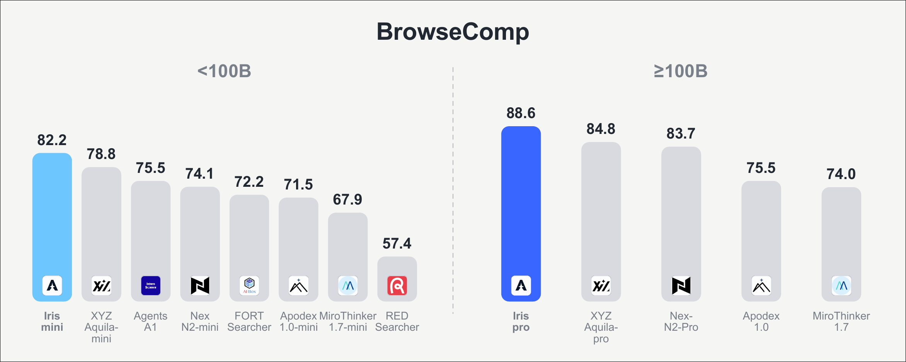
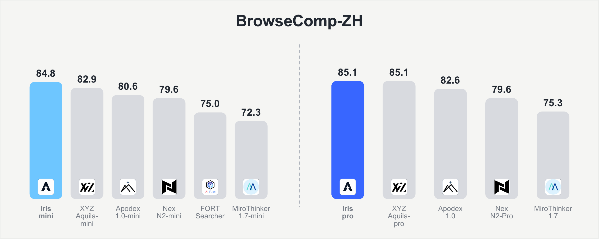
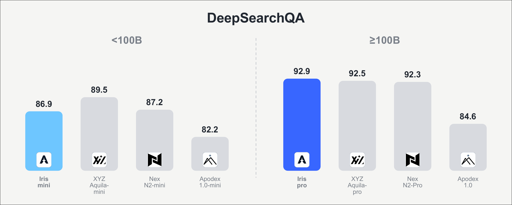
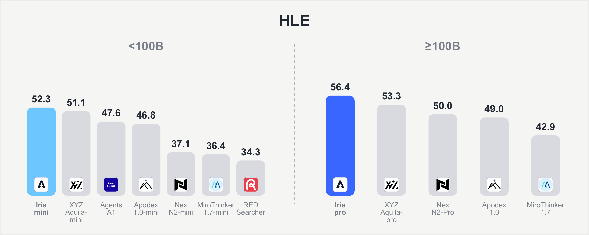

<div align="center">

</div>

---

<div align="center">
🤗 <a href="https://huggingface.co/collections/AllSpark-Research/iris"><b>Hugging Face</b></a>&nbsp;&nbsp;|&nbsp;&nbsp;
💻 <a href="https://github.com/AllSpark-Research/Iris"><b>GitHub</b></a>&nbsp;&nbsp;|&nbsp;&nbsp;
🔬 <a href="https://github.com/AllSpark-Research"><b>AllSpark Research</b></a>
</div>

# Iris

**Climbing to the Search Frontier.**

Iris-mini (35B-A3B) and Iris-pro (397B-A17B) are open-weight search agents post-trained from the
Qwen3.5/3.6 series. A capable search agent has to decide what to search, how to read what comes
back, when to keep going, and when the evidence it has gathered is enough. Iris is trained for
exactly that loop.

## Performance

<table>
<tr>
<td width="50%"></td>
<td width="50%"></td>
</tr>
<tr>
<td width="50%"></td>
<td width="50%"></td>
</tr>
</table>

**30–35B**

| Model | Size | BrowseComp | BrowseComp-ZH | DeepSearchQA | HLE |
| --- | --- | --- | --- | --- | --- |
| MiroThinker-1.7-mini | 30B | 67.9 | 72.3 | – | 36.4 |
| FORT-Searcher | 30B | 72.2 | 75.0 | – | – |
| Apodex-1.0-mini | 35B | 71.5 | 80.6 | 82.2 | 46.8 |
| Nex-N2-mini | 35B | 74.1 | 79.6<sup>r</sup> | 87.2<sup>r</sup> | 37.1<sup>r</sup> |
| Agents-A1 | 35B | 75.5 | – | – | 47.6 |
| XYZ-Aquila-mini | 35B | 78.8 | 82.9 | **89.5** | 51.1 |
| **Iris-mini** | 35B | **82.2** | **84.8** | 86.9 | **52.3** |

**~400B**

| Model | Size | BrowseComp | BrowseComp-ZH | DeepSearchQA | HLE |
| --- | --- | --- | --- | --- | --- |
| MiroThinker-1.7 | 397B | 74.0 | 75.3 | – | 42.9 |
| Apodex-1.0 | 397B | 75.5 | 82.6 | 84.6 | 49.0 |
| Nex-N2-Pro | 397B | 83.7 | 79.6<sup>r</sup> | 92.3<sup>r</sup> | 50.0<sup>r</sup> |
| XYZ-Aquila-pro | 397B | 84.8 | **85.1** | 92.5 | 53.3 |
| **Iris-pro** | 397B | **88.6** | **85.1** | **92.9** | **56.4** |

DeepSearchQA is scored with F1, the rest with accuracy; HLE uses the text-only subset. Iris numbers
use the `discard-all` context-management setting; baselines come from their public reports, each
under its own context management. <sup>r</sup> reproduced by the XYZ-Aquila team.

## Models

| Model | Base | Params (total / active) | Context | Download |
| --- | --- | --- | --- | --- |
| **Iris-mini** | Qwen3.6-35B-A3B | 35B / 3B | 256K | [🤗 Iris-mini](https://huggingface.co/AllSpark-Research/Iris-mini) |
| **Iris-pro** | Qwen3.5-397B-A17B | 397B / 17B | 256K | [🤗 Iris-pro](https://huggingface.co/AllSpark-Research/Iris-pro) |

## Context Management

Long-horizon search runs out of context before a hard question is resolved, so every serious system
carries some mechanism for this. It is worth enough that a single published number belongs to the
agent and its harness together, which is why we report every benchmark in both regimes, under one
tool set, one context limit, and one judge.

| Setting | BrowseComp | BrowseComp-ZH | DeepSearchQA | HLE |
| --- | --- | --- | --- | --- |
| **Iris-mini** | | | | |
| w/o | 64.7 | 72.3 | 81.0 | 43.2 |
| retry | – | 83.0 | 89.1 | 52.0 |
| discard-all | 82.2 | 84.8 | 86.9 | 52.3 |
| discard-all + retry | **85.9** | **85.1** | **89.9** | **52.4** |
| **Iris-pro** | | | | |
| w/o | 72.6 | 76.8 | 86.4 | 50.8 |
| retry | – | 84.1 | 92.3 | **56.6** |
| discard-all | 88.6 | **85.1** | 92.9 | 56.4 |
| discard-all + retry | **90.3** | **85.1** | **93.4** | **56.6** |

`discard-all` clears the accumulated tool history and restarts from the question once the running
context crosses a threshold. `retry` restarts an episode that ended without a parseable answer, carrying forward a short
summary of what was already ruled out. We report `discard-all` as the headline setting even where adding
`retry` scores higher.

## Evaluation

[`Iris-Harness/`](./Iris-Harness) is the harness behind every number above: the agent loop, the two
tools, the context-management strategies, the four benchmarks and the graders. It runs against any
OpenAI-compatible endpoint.

```bash
cd Iris-Harness && uv sync
uv run python data/prepare_data.py
bash scripts/run_eval.sh --base-url http://127.0.0.1:21234/v1 --llm-config iris-mini \
  --benchmarks "browsecomp:0:1" --context-discard-threshold 131072
```

---

The data construction and training pipelines are coming soon.

Questions or collaboration: reach us at
<liuziyua22@mails.tsinghua.edu.cn>.
